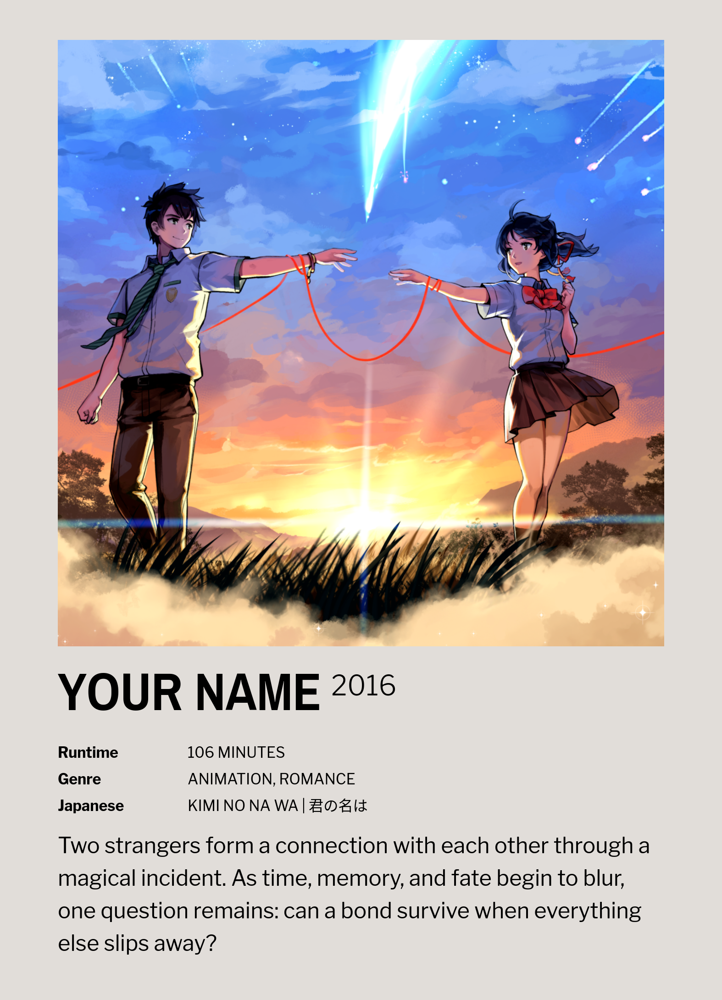

# Polaroid Printable Poster

 

_Turn a photo and a few lines of text into a print-ready polaroid poster — entirely in your browser._

## Example output

  

<em>Example output — upload any image and add your own text.</em>

## Features

- **100% client-side** — nothing is uploaded to a server
- **Single poster export** — download as PNG or JPEG
- **Dual-poster PDF** — two posters side by side on an A4 landscape sheet
- **Flexible metadata** — add as many key/value rows as you need
- **Rich paragraph text** — supports ` ` for line breaks and `
` for a horizontal divider
- **Three font presets** — Film Credit, All Condensed, and Clean Sans
- **Print-ready** — output rendered at **300 DPI**

## How it works

1. **Upload** an image and fill in your text fields
2. **Generate preview** and tweak the font preset if needed
3. **Download** as PNG, JPEG, or PDF

## Usage

### Create Image

1. Open the **Create Image** tab.
2. Upload an image (square images work best).
3. Optionally fill in **Name**, **Year**, **Metadata** (key/value rows — click **Add field** for more), and **Paragraph**.
4. Choose a **Font** preset.
5. Click **Generate preview**.
6. Adjust the font in the preview if needed.
7. Download as **PNG** or **JPEG**.

### Create PDF

1. Open the **Create PDF** tab.
2. Fill in the same fields for **Poster 1** and **Poster 2** (each requires an image).
3. Click **Generate preview** to see both posters on an A4 landscape sheet.
4. Adjust fonts per poster in the preview if needed.
5. Click **Download PDF**.

## Input details

| Field            | Details                                                             |
| ---------------- | ------------------------------------------------------------------- |
| **Metadata**     | Optional key/value pairs; add as many rows as you need              |
| **Paragraph**    | Supports ` ` for line breaks and `
` for a horizontal divider |
| **Font presets** | Film Credit, All Condensed, and Clean Sans                          |

## Print specs

| Setting    | Value                             |
| ---------- | --------------------------------- |
| Resolution | **300 DPI**                       |
| PDF sheet  | **A4 landscape** with two posters |
| Margins    | **12.7 mm**                       |
| Gutter     | **5 mm** between posters          |

Each single polaroid poster is **133.3 × 184.6 mm** (portrait). To match that size in Canva or another design tool, use:

| Unit    | Width | Height |
| ------- | ----- | ------ |
| **cm**  | 13.3  | 18.5   |
| **mm**  | 133   | 185    |
| **in**  | 5.25  | 7.26   |

## Local use

No build step or install required. Open the root [`index.html`](index.html) in a browser, or serve the repository as static files.
